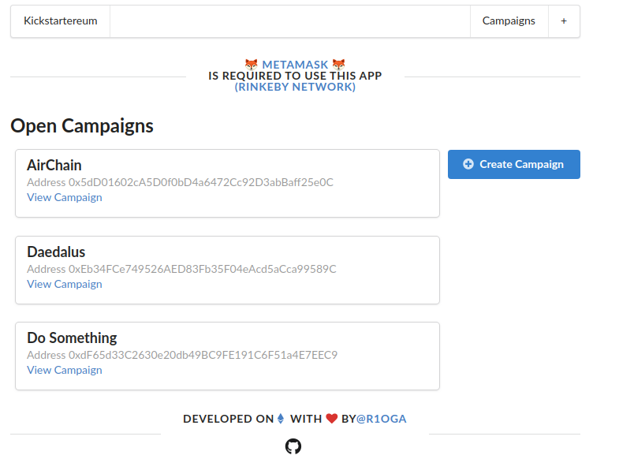

# Kicksartereum: Kickstarter on Ethereum

## Introduction
[Kickstarter](https://www.kickstarter.com) helps artists, musicians, filmmakers,
designers, and other creators find the resources and support they need to make
their ideas a reality. Potential future customers, 'backers', can contribute to a project to finance the development of a product.  
Sounds awesome.  
**However, a fundamental problem for crowdfunding is how asymmetrical the risks faced by backers and founders are.**  
After having invested, backers don't get a say on how their money will actually be spent.
Worse: which guarantee do they have that the founder they backed, will actually
deliver what they promised, and not go away which the funds successfully collected from the backers?    
Ethereum & smart contracts are a great solution to come around these issues. Indeed, the collecting of funds and spending of collected funds gets automated in a secure and a decentralized way.  
The risks previously faced by backers disappear because they get to vote on how funds are spend.
## [Demo video](https://www.youtube.com/watch?v=yJyEVvW6MI4)
## Requirements
The smart contract application I [deployed on the Ethereum Rinkeby test network](https://rinkeby.etherscan.io/address/0x1eb0ef281158ebccacf097e02111f3ab9e0743cc) fulfills the following:  
- [x] A founder can create a new campaign.
He/she sets the minimum contribution amount for future backers.
- [x] Anyone can back a created campaign, provided they contribute at least the
minimum amount set by the founder.
- [x] The smart contract controls the funds.
Neither the founder nor the backers are able to take out or spend funds collected by the campaign
- [x] Only the founder can create payment requests.
He requests the backers to agree on how to spend the campaign's funds.
He specifies the payment's recipient.
- [x] Backers can approve (1 time each) payment requests
- [x] The founder can finalize a payment request that has been approved by a majority of backers.
This automatically executes the payment (transfers amount to recipient)

## Getting started
1. Clone or download this repository
0. Install dependencies: `/kicksartereum $ npm i`
4. Run client application: `$ npm run dev`
5. Access at [localhost:3000](http://localhost:3000/)

## Development
### Compile
`/kicksartereum/ethereum$ node compile`
### Deploy
1. Set environment variables required for deployment. Create a `.env` file in
`/ethereum` with the following lines:
```
INFURA_KEY=<your infura project id>
MNEMONIC=<your metammask mnemonic>
```
2. Deploy contract: `/kicksartereum/ethereum$ node deploy`
3. Edit `ethereum/factory.js` and update the address (line 7)

### Tests
`npm test`
## Resources
- [Metamask](https://metamask.io/): 'brings Ethereum to your browser.''
- [web3.js](https://github.com/ethereum/web3.js/): Ethereum JavaScript API.
- [React.js](https://reactjs.org/): 'a JavaScript library for building user interfaces'
- [Next.js](https://nextjs.org/)
- [Semantic-ui](https://react.semantic-ui.com/): 'development framework that helps create beautiful, responsive layouts using human-friendly HTML.' Official React integration.
- [Mocha](https://mochajs.org/): 'the fun, simple, flexible, JavaScript framework.'
- [Ganache](https://www.trufflesuite.com/ganache): 'Quickly fire up a personal Ethereum blockchain which you can use to run tests, execute commands, and inspect state while controlling how the chain operates.'
- [Heroku](https://elements.heroku.com/buildpacks/mars/heroku-nextjs)
